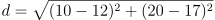
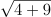
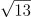
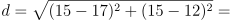
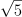
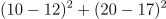
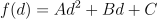
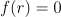
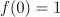
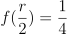

# Project 1 Brush

### Introduction to Computer Graphics, Fall 2021

## 1 Instructions

_Due Date_ : 10:00 PM EST on Sep 21, 2021.

Complete this assignment by yourself with no help from anyone or
anything except a current CS123 TA, the lecture notes, official textbook,
and the professor. Hand in the assignment using Gradescope
(which you’ll learn about through other handins) no later than 10:00
PM on Sep 20, 2021. You are allowed to use up to 3 late days on
this assignment.

## 2 Introduction

Computer graphics often deals with digital images, which are two-dimensional
arrays of color data (the pixels on the screen). Although
they are just data, these arrays can convey knowledge, emotion, or
even beauty. There are plenty of ways to create a digital image:
scanning a still photograph, capturing a screenshot of video, rendering
a three-dimensional scene, drawing a picture using a “paint” or
“draw” program, or even algorithmically generating an image from a
function. But images are rarely perfect when they first hit silicon
(or phosphor... ). We often want to make them look better than the
original. One common method of doing so is with a photo editing
program. You just select the airbrush tool, pick a convincing color,
and, before you know it, your younger brother looks like Mr. Clean.
In this assignment, you will be writing a simple image editing application
that features a digital representation of an **_airbrush_** , or
more precisely, a few different types of airbrush like editing tools.

Your program will also be able to save the images that you have
edited.
To get a general sense of what the program you’ll write looks like,
see `/course/cs1230/bin/cs1230_demo`. You can take a look at the
video here to get an idea of how your program should look and
behave as well. Your program may not implement all the features
shown in the demo; you get to choose how much you want to do for
extra credit.
Writing Brush will give you an introduction to programming in C++
using the CS1230 support code.
You will be introduced to basic graphics concepts like blending
colors and drawing images, and you’ll learn to cache calculations
and tighten your loops to make your programs much more efficient.
This program is not a model of perfect user interface (UI) design,
nor of perfect object oriented program design; we’ve made some
trade offs to keep things simple and let you concentrate on the C++
and the pixel manipulations rather than complicated interactions
among a ton of classes.

## 3 Requirements

If you have played with the demo, you’ll see that it pops up a GUI
with a canvas and controls. Don’t worry: all the groundwork of
setting up the GUI is taken care of for you. What you have to do
is write a program that adds on to the provided GUI and allows
the user to airbrush onto the canvas by clicking and dragging the
left mouse button. You must implement four different airbrushes.
The first three closely mimic physical airbrushes: they add paint
at various rates and distributions over a circular area that can be
varied in size. To implement the varying distributions of paint, your
airbrushes will use a mask — an array of values (one per pixel) that
indicates how much paint to apply at each point.

All the airbrushes you are required to create are circular in shape.
The first three will differ from each other only in the distribution of
paint that they place on the canvas.

The “distribution” describes how much paint is placed at a certain
point based on its position relative to the point where the user
clicks (since the airbrush will affect more than just the pixel the user
clicks).
For full credit, you’ll need to implement these first three airbrushes,
whose details are in the next section, and a “smudge brush”, which,
as you drag it, acts more like a paintbrush being dragged over an
already painted image, and smearing out the paint as it goes.

This is an example of something really fun that happens with graphics: 
you implement something to mimic a physical process like
airbrushing, and then realize that you can in fact generalize your
implementation in a way that would be impossible in the physical
world, and suddenly you’re inventing new tools for artists!

For the ambitious, you may implement additional types of brushes,
and if you do them well, you may earn extra credit.

### 3.1 Implementation

For a “constant brush”, each click on the canvas deposits a disk of
color, like a felt tip pen putting a fat dot on a piece of paper. One
very inefficient way to do this is to say that for each pixel of the
canvas, we compute the distance to the click point, and if it’s less
than the “brush radius”, _r_ , then we change its color to that of the
brush. Because most pixels are very far from the click point, this is
very slow and wasteful.

This straw man algorithm can be improved by restricting our attention
to pixels whose _x_ and _y_ coordinates are no more than _r_
away from the click point’s x and y coordinates respectively. Now
the only pixels we consider altering are those that lie in a square
region around the click point. The time involved is proportional to
r^2 , which is generally much smaller than the total pixel count in the
canvas.
We can do better. We can’t really do much to improve the big-O
performance, but we can certainly improve the constants a lot. Let’s
look at an example of a radius -six brush. Suppose the click-point is
(10 , 20), and we’re looking at the canvas point(12 , 17)to see whether
we should re-color it. We compute the distance

and see whether it’s less than our radius, Well, the distance turns
out to be  = , which is less than 6 , so we recolor that
point of the canvas.
Now let’s suppose the click point is(15 , 15) and the canvas point is
(17 , 12). How do we compute the distance? Well, we take

  = 

And as we look at that, we see that we’re really computing the same
number again, and for the same reason! In each case, the test pixel
was 2 units right and 3 units below the click point. We can therefore
do something really clever: we can make an array of distances, one
for each possible ‘offset’ from the clicked pixel. The central entry
in our array will correspond to offset(0 , 0), and hence the distance
value stored there will be 0. One unit up and two units to the right
of that central entry will correspond to offset(1 , 2), and the distance
stored there will be 2. 236 ≈ , and so on.
Now for any canvas pixel, we can use the offset from the clicked
pixel to look up the distance in the array rather than computing
it. We compute all those slow square roots just once, at program
initialization.

Once we _do_ look up a distance in this table, we’re going to use it in
a very simple way: we’ll compare it to the radius, 6 , and depending
on the result, add paint or not. So instead of an array of _distances,_
we could just make an array of 0 / 1 values: 0 indicates “too far” and
1 indicates “close enough.” Now for any given offset from the clicked
pixel, we look up the entry for that offset in our array and get either
a 0 (don’t add paint!) or a 1 (add paint to this pixel!) Such an array
is called a **_mask_**. And the kind of mask described works perfectly
for the “constant brush” that mimics the felt tip pen.

When we want to have a “linear brush” (one that deposits a lot of
paint in the center and none at distance _r_ ), we can generalize a bit:
instead of storing 0 s and 1 s in the mask, we store numbers ranging
from 0 to 1 , where 0.5 means “replace the canvas color with a 50 
mix of canvas color and brush color”, etc.

_All your brushes will be implemented using masks_. That means
that you’ll do distance computations only when you first create the
brush (or change its radius). This turns out to speed up the whole
paint deposition process hugely.
Pro tip: if you want to know whether some distance is less than 6 ,
you can instead compute the _squared_ distance and check whether
that’s less than 36. In particular, when we were doing distance
computations earlier and asked whether

was less than 6 , we could equally well have asked whether

was less than 36. From an efficiency point of view, there are several
advantages to doing this. The first is that we don’t have to compute
a square root, which may be slow on some architectures. The second
is that to compute that square root, we have to convert integers
to floating point numbers, and that’s generally slow. Practically

speaking, neither of these matters for this assignment, but as you
look at graphics programs in the future, you’ll often see people
comparing squared distances rather than distances, and now you
know why.

### 3.2 Mask Distributions

The three constant color brushes have different distributions of color:
Constant : This distribution will place an equal amount of paint at
each pixel within the airbrush’s radius.
Linear : This distribution will place a linearly decreasing amount
of paint at each pixel as you move away from the center point. So
at the center point, you will have full intensity of paint, where as
at radius pixels away from the center, no paint will be put on the
canvas.
Quadratic : This distribution will place a quadratically decreasing
amount of paint at each pixel as you move away from the center
point, i.e., the amount f ( d )of paint used is a quadratic function of
the distance d from the center point, so f can be written

for some numbers A, B, C.
Your quadratic function f should have three properties:

-  , where _r_ is the radius of the brush.
-  , so at the center of the brush, paint is fully applied
-  .

These uniquely determine the values of A , B , and C.

### 3.3 The Smudge Brush

In addition to the constant color brushes described in the previous
section, you are also required to implement a **_smudge brush_** which
produces a paint smear effect when dragged across your canvas.
For this brush you will ignore the paint color selected by the user.
You can use whatever kind of mask distribution you think works
best (there is no correct answer): constant, linear, quadratic, or
something else. We’re going to give you the pseudocode for the
smudge brush; you just need to implement it. The implementation
involves a little bit of C++ memory management, which is why
we’re having you do it.

There are two basic operations you will need to implement for the
smudge brush.

1. Pick up paint. This operation copies the part of your 2d image
    that is currently under the mouse cursor. You should allocate a
    temporary buffer to be used as storage for this image fragment.
    Do not copy the entire image — just the part that’s under the
    brush mask.
2. Put down paint. This operation blends the contents of the
    buffer you filled when “picking up paint” with the region of your
    canvas that is under the brush mask centered about the current
    mouse position.

Here’s how the smudge brush works:

When the canvas is (left)clicked, you pick up paint. When the
mouse is dragged, you put down paint (altering the canvas) and
then immediately pick up paint again, by overwriting the temporary
buffer with data from the altered canvas.

### 3.4 [Optional] Extra credit

Remember that half-credit requirements count as extra credit if you
are not enrolled in the half-credit course.

3.4.1 Extra Brushes

We have provided two slots for extra brushes you may wish to create
for extra credit. You have great freedom regarding what you can do.
The distribution can be whatever you want; it doesn’t even have to
be an airbrush.
In the demo, we have provided a spiderweb brush, which performs
a line drawing effect, as well as a ripple brush which introduces
animation. You can rename the radio buttons in the GUI by editing
MainWindow.ui. You can earn up to 10 points of extra credit, but
we’re going to favor quality over quantity here. We’d rather see you
make one really awesome brush than two run of the mill brushes.

3.4.2 Fix Alpha Blending

You may notice that when drawing with a semi-transparent constant color
brush (i.e., not the smudge-brush) the results aren’t quite what
you expect. If you draw a stroke from the left edge to the right
edge with a red linear brush, on a white canvas, for instance, you
might expect to get a bright red centerline that fades to pink and
then white as you move away from the centerline. Every horizontal
line should be a constant tone line. But in fact the horizontal line
halfway to the edge ends up looking full red. Why? Because when
the brush is at( x, y ), pixel( x, y + 5) gets some red, maybe 50 %.
Then when the brush is at( x + 1 , y ), that pixel gets some more red,
maybe46%more, and so on. And pretty soon, it’s 100 percent red.
So you end up with a wide band of solid red, fading rapidly to just
a few percent red at the edge.

Here’s a solution to the problem: consider moving the mask across
an empty canvas, copying density values onto the canvas instead of
color, and with the rule that we copy a density value only if it’s _larger_
than the density value that’s already there. We end up with a canvas
full of density values, which we then use to apply to brush color to
the original (as yet untouched) canvas. This produces the expected
result, but during the dragging process, what do we display? We
could wait until the end of the click-and-drag stroke and then display
the new canvas, but that doesn’t feel right. So the challenge here is
to figure out how to do something that produces the same end result
as this improved algorithm, but shows nice intermediate results as
well. It should still be fast — almost as fast as using a linear brush,
for instance — but it may well use a lot more memory.

### 3.5 Half-Credit Requirements

Remember that half-credit requirements count as extra credit if you
are not enrolled in the half-credit course.

1. For Brush you will need to correct the transparency issues
    noted in the third paragraph of Section 3.4.2. In the demo one
    potential solution is implemented as the “No Alpha Blending”
    option on the brush tab.
2. You must also implement one _really awesome_ brush. A
    good choice would be a brush similar in difficulty to the
    spiderweb and ripple brush in the demo. If you are uncertain
    about whether a brush meets this requirement, email
    cs1230tas@lists.brown.eduto check.

## 4 Paint

Colors on our canvas are represented by four one byte unsigned char
values, one for each of red, green, blue, and alpha (r, g, b,and
a for short). These represent, respectively, how much red, green,
and blue light are combined to make a color on some surface, and
how opaque that surface is. So if you take some window screen and
spray paint it blue, the red and green values will be zero; the blue
will have its maximum value, and "a" will be about 20 percent of its
maximum value, because window screen is mostly open space. We
think (for now! Later in the semester we’ll have a lot more to say
about color) of red, green, and blue ranging from 0 (no intensity)
to 1 (the brightest we can produce), but because integer arithmetic
is really fast and easy to implement in hardware, we actually use
numbers from 0 to 255 to represent the range 0 to 1. The same goes
for alpha. So a pixel color is a four byte chunk of memory in the
computer.
This gives us about 16 million possible RGB color combinations,
each of which can be associated with a different alpha (or “coverage”)
value.
The canvas on which we’re drawing will have all its alpha values set
to 255 ; there are no “transparent” pixels in our drawings. On the
other hand, the airbrush masks will contain density values that are
between 0 and 1 , and this represents what fraction of the canvas pixel
should be covered by the paint.
Then there’s the paint itself. If you think of the paint as a transparent
fluid with tiny pigment particles suspended in it, there’s a whole
range of possibilities: there could be so much pigment that nothing
shows through the paint; there could be less pigment (think of
something like cranberry juice) so that the underlying color shows
partly through the paint, etc. This "coverage by pigment" is the
alpha value of the brush color. If you apply red paint with a = 255
onto a blue canvas with a constant brush, just a single click, you get
a solid red disk on a blue background. If you apply red paint with
a = 70 in the same way, you get a blue canvas with a uniformly
purplish disk on it: the paint went everywhere, but you could see
through it.

You can see that the “coverage” value stored in the mask and the
pigment fraction (or a-value) of the paint itself have similar effects
on the final color of the pixel. One thing to note is that the final
alpha value of the canvas pixel is still a hundred percent (represented
as 255 ): painting solid white paper with cranberry juice doesn’t
suddenly make the paper itself transparent!
So how, exactly, do we choose what color to assign to the canvas
pixel? Well, what you have to work with is

1. The distribution of the airbrush at the relevant location, a
    number between 0 and 1.
2. The starting color of the pixel you are painting on
3. The alpha value of the pixel you’re painting on, which is always
    255.
4. The RGB part of the airbrush color
5. The alpha value of the airbrush color

You will want to blend the colors on the canvas with the current
paint color of the airbrush. How much of each color you use will
depend on how far the pixel you are coloring is from the point where
the user clicked, the distribution, the radius of the airbrush, and
the paint flow. For part of the Brush algo, you will decide on an
explicit function that provides the blending behavior seen in the
demo. The process is also described as **_over_** compositing, in Section
17.4.1-17.4.2 of the text, although that discussion does not include
the distribution value.

## 5 Code structure

This is a long section, but it introduces you to the structure of the
code you’ll be working with all semester, so it’s worth reading.
The code design contains several software engineering compromises,
resulting in your having to write code that seems repetitive, or having
to store the same data in multiple places, etc. Some of these are
artifacts left from multiple years of small project updates without a
large scale redesign. Others are things that lead to stupid but simple
code instead of smart but complex code. Given the limited time you
have to grasp the overall structure, stupid but simple is sometimes
a good choice.
When you open the QtCreator project file, you’ll see, on the left,
two views of the code (depending on what items you choose from
the small menu at the top just to the right of the word “Projects”).
One of these is File System, the other is Projects. They show
you the same files, but the upper one is organized by the project
structure. Thus all the header files (the ones ending in .h) are
gathered together, albeit divided into logical groups, and all the
Source files are too. If you double click on a file at the left, it’ll open
up in the main window area on the right. I’ll describe files in the
Project view using » separators, so that Headers » Brush » Brush.h
indicates the file in the Headers section, Brush subsection, called
`Brush.h`. For ordinary file system paths, I’ll use slashes, so that file
is also `projects/brush/Brush.h`.
Let’s look in the Headers section; the Sources section is completely
parallel. The subsections are brush, camera, gl, glew-...,
lib, scenegraph, ui. Three of these are easy: brush, camera,
and scenegraph each contain files corresponding to one of three
CS123 projects. As you might guess, you’ll be messing with the
files in brush, but not touching the other two, at least for this
project. If you’ve “built” the project, there may be a file (you may
have to close and reopen the project or QtCreator to see it), called
`ui_mainwindow.h`, in which the sole Canvas2D for the project is
declared. You’ll never need to look at this file, but if you do, you’ll
see that when an instance of the `Ui_MainWindow` class is created,
that `Canvas2D` is also created.
The gl section is all the stuff related to OpenGL, which is the graphics library that we’re using in CS123, at least indirectly. OpenGL is
basically the glue that ties together processing on the graphics card
with processing on the CPU — it’s kind of an operating system level
piece of software. Of course, just as different CPUs have different
features — more cache, fewer processors, etc. — each graphics card
has different features, so that while almost all provide a certain core
of functionality, different graphics cards support different OpenGL
‘extensions’. To quote the documentation, GLEW provides efficient
run time mechanisms for determining which OpenGL extensions are
supported on the target platform. For now, at least, you should
regard GL and GLEW as “the magic that ties together my code
with what happens on the graphics card.” Part of the point of the
Qt library is to sit atop these and isolate the user from having to
consider them. You’ll also be creating classes in the first lab that
will be added to this folder in the next project.
Continuing, there’s lib, which contains some TA code for supporting
various projects. The only relevant one of these, for this project,
is the `RGBA` structure, which is used to store the value represented
by each pixel. If you look into the `RGBA` structure, you’ll see that
it’s just a fancy name for dealing with four adjacent bytes of data,
but provides some helpful functions for adding or subtracting pixel
values, for instance.
Next, there’s the ui section. Most of these items you’ll never touch,
but `Settings` and `Canvas2D` will matter to you.

- The `MainWindow` class describes the appearance and behavior
    of the interface overall.
- As you’ll have seen from the demo, one part of the interface is
a canvas on the right-hand side; above this are a pair of options
to make it a 2D canvas or a 3D one. The appearance/behavior of these
two canvases are defined by `SupportCanvas2D`
and `SupportCanvas3D`, which are basically just thin wrappers
around certain Qt-defined structures, presenting to you, the
student, a relatively simple interface.

- The `Canvas2D` class derives from `SupportCanvas2D`.
    It has utility methods to make each of the 2D
    projects simpler. For the Brush assignment, these are
    `mouseDown`, `mouseUp`, `mouseDragged` and `settingsChanged`;
    for those who want to get fancy and allow for changing the size
    of the window,`notifySizeChange` may also be useful. You
    can ignore the other methods — the ones associated to other
    projects —- in this class. As you might guess, when the user
    clicks the mouse in the 2D canvas of the interface, Qt calls the
    mouseDown method with the location of the click. You, the
    programmer, need to respond to this by making the canvas
    look different (i.e., by adding paint to the canvas). You do this
with a three-step process:
1. Request from Qt an array of data describing what’s currently displayed
on the canvas. The `data` method of
`SupportCanvas2D` returns a pointer to an array of `RGBA`
values representing the canvas’s contents.
2. Change some of the values in this array of data. For instance,
if you’re applying paint with a red constant brush,
you might setdata[i] to be an `RGBA` whose contents are
{255, 0, 0, 255}for several values of _i_ , one corresponding to 
each pixel that needs paint applied. Changing these
values, i.e., altering the contents of some variable in the
CPU of your computer, has absolutely no effect on the
displayed canvas, however. The displayed canvas contents
are based entirely on stuff happening in the GPU.
3. Invoke the `update` method of the `SupportCanvas2D`. This
takes the altered `data` array and sends it to the GPU
by invoking the right OpenGL functions. When `update`
returns, the canvas in the UI will be displaying the new
contents.

- The `Databinding` class connects visual interface elements like
    sliders or text boxes to variables that you as a programmer
    can work with. In particular, it’s used to connect the “radius”
    slider, for instance, to the `brushRadius` member of a `Settings`
    structure.
- The `Settings` class is the main tool for connecting you, the
    programmer, with what the support code provided interface is
    doing. There’s a single instance, `settings`, of `Settings` created
    in the project. The other parts of the interface interact with
    `settings` so that when the user adjusts the “radius” slider for
    the brush, for instance, the value `settings.brushRadius` is altered. 
    Whenever any setting is changed, the `settingsChanged`
    method of `Canvas2D` is called, allowing you, the programmer,
    to respond as you see fit.

This `settings` structure is not a pretty piece of design, but it gets
the job done. When you’re told the setting changed, you might ask
"Well, which _one_ changed?" The only way to tell whether the radius
changed is to have recorded the radius previously, and see whether
it’s different. (If so, you’ll want to alter a brush, _and_ record the new
radius!) There’s a little more discussion of this below.

### 5.1 The UI

In Forms » ui » MainWindow.ui is a file that describes, in some Qt-
specific way, the appearance of the main window of our application,
along with its menu bar, etc. If, in QtCreator, you double click on this
item, a UI editor will show up, and you can see how you might choose
to move the label on the radius slider up by one millimeter, or change
the font on the labels for the various brush types. If you were to click
on the "Constant" radio button in the Brush panel, you’d see lots of
information about it displayed; in particular, you’d see it’s associated
with an object namebrush `TypeConstant`. In `MainWindow.cpp`, that
name gets used to tie together that radio button with other parts
of the code. In particular, at line 138 you’d see that this interface
element is “bound” to `settings.brushType`, so that whenever a
user clicks this radio button, the value in `settings.brushType` is
altered.

### 5.2 The main program

In Sources » main.cpp, we have the main program for this application. It creates a `QtQApplication` instance called `app`, and a
`MainWindow` instance `w`. This `MainWindow` instance also creates a
single instance of a `Canvas2D`. The main program then ‘shows’ the
window `w`, and invokes the `exec` method of the `QApplication`. This
hides from you, the programmer, a complex sequence of operation.
Qt communicates (via OpenGL) with the GPU to say that it wants
to run a GPU program that will display things in a certain region
of the display. Qt also creates various objects in CPU memory (for
example, the settings structure), some of which represent visual elements in the displayed window, and others of which (like `settings`)
serve other purposes. Qt then establishes a connection between that
GPU program and the CPU objects, so that when the user clicks
somewhere in the displayed window, these two entities — the CPU
program and the GPU program — communicate. The result for you,
the programmer, hides all details of this communication.
All that you, the programmer, need to know is that when the user
clicks on an interface element like a radio button, two things happen:

1. Some component of the `settings` structure is altered.
2. The `settingsChanged` method of a `Canvas2D` instance is called.

What instance? The one that the `MainWindow` object created
and associated to the drawing area of the application.

Youl typically respond to this by altering, in the `settingsChanged`
method, some `Brush` object in your program.

What about a click in the canvas area of the window?

When you, the programmer, want to respond to such a mouse click,
you put code in the `mouseDown` method of `Canvas2D`. This code, as
described above, may ask for the pixel contents of the canvas by
invoking the `data` method. The execution of that method involves Qt
asking OpenGL to communicate with the GPU, which then transfers
a large block of data to the CPU, which you, the programmer, see as
the return value from `data`. You alter that returned array of pixels
by ‘adding paint’, but in doing so, you’re merely altering an array
in CPU memory. When you invoke the update method (which has
been inherited from the Qt object representing the canvas), that
modified array of pixels is sent to the GPU for display, and the
appearance of the canvas on your computer actually changes.

### 5.3 Things you’ll edit

So the big picture, from your point of view, is this:

- there is a single instance of the `Settings` class, called `settings`;
    it’s declared in `Settings.cpp`, and mentioned in `Settings.h`
    so that any code that includes `Settings.h` has access to this
    instance. In particular, your code in the `Canvas2D` class can
    access this instance.
- There’s a single instance of the `Canvas2D` class, created during
    the setting up of the `MainWindow` in `main.cpp`.

_All of your interaction with the Qt application will be through these
instances._

Within your work on the `Canvas2D`, you’ll also need to work with
various brush types.
To work on this project, you’ll edit the various Brush classes (although
you’ll probably leave Brush untouched), and within the ui
section, you’ll edit `Canvas2D.[cpp, h]`. It’s perfectly OK to add
methods, member variables, etc., to these classes.
Obviously at some point you’ll need to create and hold onto a `Brush`.
This should be part of (i.e., a member variable of) the `Canvas2D`
class; when the sole instance of this class is created, you’ll want to
create a Brush as part of it.
Another aside on software design: we have the constant, linear,
and quadratic brushes, all of which have some color of paint that
they deposit on the canvas. When the user adjusts the "red" slider,
the color associated to the current brush should be changed. But
then we also have the smudge brush, which has no intrinsic color.
It picks up paint from the canvas. What should we do when the
color sliders are adjusted? In one design, we’d have an intermediate
class (say, `ColorBrush`, that’s a parent to constant, linear, and
quadratic brushes, but not the `SmudgeBrush`. When the user selects
the smudge brush option in the interface, the color sliders would be
greyed out. That results in a lot of complexity for something that
really makes almost no difference, so we put the brush color into
the Brush class, and expect you to adjust it when the sliders move,
whether it’s a constant brush or a smudge brush. Adjusting it on
the smudge brush has no effect on anything, but at least you can do
exactly the same thing no matter what type of brush you have – no
special case handling. This lets you concentrate your efforts on the
things we want you to learn in this assignment: masks, pixel access,
color blending.
What about settings? When `settingsChanged` is called, all that you,
the programmer, know is that something in the global `settings`
structure is different from what it was a moment ago. Did the
radius change? Did the color change? Did the user choose a new
kind of brush? You have to figure that out. So you might want to
compare `settings.brushRadius` to the previous radius value. To
do so, you’ll need to record the previous radius value. This suggests
you might want to add not only a `Brush` to `Canvas2D`, but also an
int with a name like `m_current_radius`.
In short: `Canvas2D` is where you’ll want to store any persistent data
in your program.
NB: Suppose you decide you want to add a `Brush`, or a `Brush` reference, or a `Brush` pointer as a member of `Canvas2D`, and try
typing something like this:
private:

`Brush m_brush;`

You’ll get an error saying that `Brush` doesn’t mean anything. That
means that you need to alter `Canvas2D.h` to include `Brush.h`. Don’t
be shy: go ahead and include any header files you find you need.

## 6 Getting Started

To start work on this assignment, you will need to first fill out our [Getting Started form](https://docs.google.com/forms/d/e/1FAIpQLSfjN1w1alib4UWw4Ln8MSaphMXd8FN6Dyjw6QDtspmOwS7JkA/viewform). Once you've done so, use this [GitHub Classroom invite link](https://classroom.github.com/a/jGhMdNNB) to create your personal `projects` repository. You will then clone your repository to your local machine to work on it!

## 7 Support Code

For this assignment these are the classes/files you will care most
about:

### 7.1 settings.[cpp, h]

You don’t need to edit this file.
The global static `settings` variable, declared in `Settings.cpp` and
`Settings.h`, allows you to easily retrieve parameters set by the GUI
interface. Every time a setting like the brush radius is changed, the
support code alters the corresponding member of `settings`, and
calls the `settingsChanged` method of `Canvas2D` so that you can
respond to the change.
These include:
'''
int brushType;
int brushRadius;
int brushRed;
int brushGreen;
int brushBlue;
int brushAlpha;
'''

The user can interactively change various parameters for the airbrush
including color (including alpha), radius, and distribution. All the
sliders pass integers in the range of 0 to 255. It’s not necessary
to query the sliders for their values, because as mentioned, at any
change, the value produced by that change will be recorded in some
field of the `settings` and the `settingsChanged` callback will be
invoked.

When the user selects one of the distribution radio buttons (constant,
linear, etc.), one of the enum values defined in `settings.h` will be
assigned to the `brushType` variable.

The Brush Radius slider, bound to the `brushRadius` setting, controls how large the brush is. The value of the slider should correspond
to how many pixels away from the center the mask extends. Note
that the mask should always have an odd width and height; thus, if
the radius is 1 , the mask width and height should be 3 , if the radius
is 3 , the mask width and height should be 7 , etc. If the radius is 0 ,
the mask width and height should be 1.

The “Alpha” slider, bound to the `brushAlpha` setting, controls how
much paint is laid down when the brush is applied (flow). For
example, if the current brush is a constant distribution, and flow is
set to 255 , then the color being laid down should completely replace
the existing color on the canvas. If flow is set to 0 , then the brush
should have no effect. Intermediate values should somehow modulate
between the existing pixel color and the new pixel color. We are
being purposefully vague here. It is up to you to implement a paint
combination model that mimics reality.

### 7.2 canvas2d.[cpp, h]

`Canvas2D` will be your implementation of a 2-dimensional image
canvas. You will be using this canvas for all projects in this course
which require pixel level manipulation of images, which are BRUSH, FILTER, INTERSECT, and RAY.
The `Canvas2D` class you are given extends from `SupportCanvas2D`,
which provides several key facilities for you:

- You can resize the canvas by calling `resize()`. The canvas is
    not automatically resized when the GUI resizes; rather, scroll
    bars allow you to view the entire image.
- Image load and save. `loadImage()` and `saveImage()`
- Mouse events – `mouseDown()`, `mouseDragged()`, and
    `mouseUp()`.
- Access to the raw image pixel data with `data()` – keep reading
    for more on this

### 7.3 Dealing with raw image pixel data

In this assignment, you are required to operate directly on pixel
data, rather than relying on convenience methods. There are several
reasons for this requirement. One is that keeping track of array
indices is a common theme in computer graphics, so becoming
comfortable dealing directly with arrays will help greatly in the long
run. The other is that speed is paramount in computer graphics,
and operating directly with pixel data is efficient. Though speed
may not be a factor in Brush, it will be much more important in
later assignments. To get the raw image data, you will need to use
the `Canvas2D::data()` method. The `data()` method will return a
pointer to the beginning of the block of memory used to store the
canvas. In graphics, you will almost never see `put` and `get` methods
being used for pixels.
You may notice that `data()` returns an `RGBA*`. This is a pointer to
the beginning of an array of `RGBA`s. Each `RGBA` is a 4-byte struct
with red, green, blue, and alpha values (in that order) ranging from 0 to 255. You can either access the members of each RGBA using the
.r .g, .b, .a fields, or you can cast the `RGBA*` to an `unsigned char*`.
The support code only looks at the RGB values in each `RGBA`, so you
don’t need to worry about the alpha value of a particular pixel (it
can be left unchanged at 255 ). Instead, you’ll use the alpha value
set by the slider in the GUI, which you’ll use when setting RGB
values you paint. The `RGBA`s are stored in row major order. Each
consecutive `RGBA` is one pixel to the right of the last one, and they
wrap around at the border of the image to the left column of the
next row (just like the characters on this page).

### 7.4 Memory management

We’ve spent a lot of time ensuring that our support code doesn’t
leak memory, and we expect you’ll do the same. Prefer automatic
storage to dynamic storage unless you are allocating a lot of memory.
Try to use smart pointers instead of raw pointers wherever possible,
i. e. avoid using `new` and `delete`.
As a reminder - go to the C++ help sessions. If you miss them, the
presentations are posted online.

### 7.5 Other files

There are many other source files that you will be building along
with this project. While you don’t need to worry about what they do
(or don’t do), feel free to explore. We’ve intentionally provided you
with all the code you’re going to get for this course right off the bat.
You might not like something we’ve done or maybe feel restricted
in some way; feel free to hack away to your heart’s content! Just
be sure to keep the support code intact for your future assignments.
Back up your files often, or better yet, use version control.
You might also feel like some things are missing. That’s because
there are things missing! Feel free to extend the support code to
provide whatever functionality you need. Since this course will
get complex quickly, we recommend that you use the class and
inheritance facilities that C++ provides. Good organization now
will pay dividends very quickly. In fact, we think it’s one of the best
investments you can make at this point.

### 7.6 Warning about integer arithmetic

You may have already run into this snafu before in your CS career
but if you haven’t, beware of integer division. In C++, 255 / 256
turns out to be 0.
To avoid this problem, whenever you divide two integers, first cast
one of them to `float`. Alternatively if one of the numbers is a
constant, append “.0” or “.f” to the end of it. For example, foo/
should be written `foo/256.0` or `foo/256.f`.

## 8 Handing In

In CS1230, there are two separate handins for each assignment. The
first is a handin in which you answer questions about algorithms
and design; this is typically referred to as an “algo.” The other is
the typical digital copy of your program’s source code.

### 8.1 Algorithm Assignment

In this first handin you must describe the algorithms and design you
will use for the actual programming component of the assignment.
For each assignment, we will ask some specific questions, and may
give you other guidelines about what we expect you to turn in.
Immediately after the due date for the algorithm handins, we will
make available a handout that answers those questions and generally
describes the TAs’ suggestions on how to approach the program.
You are free to use the approach that we suggest in that second
handout, but we recommend using your own method if you feel at
all comfortable with it.

**The algorithm handin will not be accepted late.**

This is to get you thinking about the assignment early on, and to
help you clarify your understanding of the important concepts of a
program before you start trying to code. It is meant to help you
determine how well you understand things, to help you understand
them better, and to emphasize the importance of the concepts
involved.

_Don’t leave it until the last minute._

### 8.2 Handing in your code

Be sure to compare your implementation to the demo prior to
handing in! For this and all future projects, hand in your entire
projects directory (i.e. the one containing all the code and the
`CS123.pro`), not just Brush. Before you hand in your code, write
a brief `readme` file that explains any design decisions you made and
any bugs your program might have. We will be more lenient while
grading if we find a bug that was mentioned in your readme file.
Call your readme file something like `README_Brush.txt` (you’ll be
using the same code for all your assignments this semester).
For this assignment as well as all future assignments, please reference
the GitHub Classroom and Gradescope guide here in order to hand 
in your work. The guide will walk you through the required steps
to hand-in your submission and to set up each of your GitHub and
Gradescope accounts if you haven’t already done so.
Because all your code is anonymously graded, please do not put any
identifying information in your code or your README!

Because this is the first assignment of the semester, it’s a good time
to get in the habit of starting early. Remember, the assignments
build upon each other, so it’s important to keep up. Good luck!

